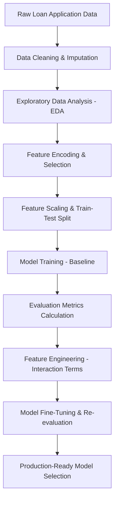

# 💼 CreditWise Loan System: A Machine Learning Loan Approval Prediction System

[](https://www.python.org/)
[](https://scikit-learn.org/)
[](https://pandas.pydata.org/)
[](https://opensource.org/licenses/MIT)

An end-to-end supervised machine learning pipeline designed to automate credit underwriting, evaluate borrower profiles, and predict loan approval decisions. The model achieves **87.5% accuracy** and a **79.0% precision** on a 1,000-row real-world credit dataset, minimizing default risks for lending institutions while speeding up approval turnaround.

---

## 📌 Project Architecture & ML Pipeline

The CreditWise pipeline follows a structured, production-grade Machine Learning workflow:



1. **Data Ingestion & Cleaning**:
   - Dropped unique identifiers (`Applicant_ID`) to avoid leakage and overfitting.
   - Handled missing numerical data using mean imputation (`SimpleImputer(strategy='mean')`).
   - Handled missing categorical data using mode imputation (`SimpleImputer(strategy='most_frequent')`).
2. **Exploratory Data Analysis (EDA)**:
   - Identified and handled a **70.2% to 29.8% target class imbalance** (`Loan_Approved`).
   - Analyzed credit score distributions, discovering a clear loan approval threshold at credit scores $> 650$.
3. **Feature Encoding**:
   - Applied **Label Encoding** to ordinal variables (`Education_Level`) and the target variable (`Loan_Approved`).
   - Applied **One-Hot Encoding** (dropping the first category to prevent the dummy variable trap) to nominal features (`Employment_Status`, `Marital_Status`, `Loan_Purpose`, `Property_Area`, `Gender`, `Employer_Category`).
4. **Feature Scaling**:
   - Scaled all continuous variables using `StandardScaler` to ensure algorithms like Logistic Regression and KNN are not biased by feature magnitudes.

---

## 📊 Performance Comparison Metrics

The models were evaluated before and after engineering non-linear polynomial features:
* **Baseline models** use standard features.
* **Fine-Tuned models** incorporate engineered polynomial features: `DTI_Ratio_sq` ($DTI^2$) and `Credit_Score_sq` ($Score^2$), dropping the original collinear variables.

| Model / Stage | Accuracy | Precision | Recall | F1-Score | Confusion Matrix (TN, FP, FN, TP) |
| :--- | :---: | :---: | :---: | :---: | :---: |
| **Logistic Regression (Baseline)** | 86.5% | 78.3% | 77.0% | 77.7% | `[[126, 13], [14, 47]]` |
| **Logistic Regression (Fine-Tuned)** | **87.5%** | **79.0%** | **80.3%** | **79.7%** | `[[126, 13], [12, 49]]` |
| **Naive Bayes (Baseline)** | 86.5% | 80.4% | 73.8% | 76.9% | `[[128, 11], [16, 45]]` |
| **Naive Bayes (Fine-Tuned)** | 86.5% | 78.3% | 77.0% | 77.7% | `[[126, 13], [14, 47]]` |
| **KNN Classifier (Baseline)** | 76.0% | 62.7% | 52.5% | 57.1% | `[[120, 19], [29, 32]]` |
| **KNN Classifier (Fine-Tuned)** | 75.5% | 62.0% | 50.8% | 55.9% | `[[120, 19], [30, 31]]` |

### 🔍 Key Insights:
* **Fine-Tuned Logistic Regression** emerged as the top-performing model, boosting **Recall to 80.3%** and **Accuracy to 87.5%**. This means the model catches more valid loan candidates while keeping false alarms low.
* **Naive Bayes** served as an excellent, high-precision baseline (80.4% precision), indicating that feature distributions align well with probabilistic boundaries.
* **KNN** performed poorly (76.0% accuracy) due to the high dimensionality (28 features after One-Hot Encoding), causing distance metrics to become sparse and less informative.

---

## ⚡ 5 Strategies to Further Boost Performance

If deployed to production, these industry-standard techniques can drive further improvements in model performance:

### 1. SMOTE (Synthetic Minority Over-sampling Technique)
* **Problem**: The target variable has a substantial class imbalance (70.2% "No" vs 29.8% "Yes"). This causes models to bias their predictions towards rejecting loans.
* **Solution**: Apply `SMOTE` from the `imblearn` library on the training set to synthetically generate minority samples. Alternatively, inject `class_weight='balanced'` inside the Logistic Regression solver.

### 2. Advanced Ensemble Methods
* **Problem**: Linear models and simple Naive Bayes struggle to capture complex, non-linear interactions without manual feature engineering.
* **Solution**: Implement tree-based ensembles such as **Random Forest**, **XGBoost**, or **LightGBM**. These algorithms handle mixed data types natively and excel at capturing complex threshold splits (e.g., Credit Score $> 650$ combined with specific income brackets).

### 3. Systematic Hyperparameter Tuning
* **Problem**: Models currently run on default settings, leaving untapped optimization on the table.
* **Solution**: Utilize `GridSearchCV` or `RandomizedSearchCV` combined with Stratified 5-Fold Cross-Validation to tune critical hyperparameters, such as $C$ (regularization strength) in Logistic Regression, or tree depth and learning rate in XGBoost.

### 4. Domain-Specific Feature Engineering
* **Problem**: Generic scaling of individual variables limits the representation of overall borrower capacity.
* **Solution**: Create meaningful financial ratios:
  - **Debt Service Coverage Ratio**: Combining monthly income, existing debt obligations, and requested loan terms.
  - **Collateral Coverage Ratio**: $\frac{\text{Collateral Value}}{\text{Loan Amount}}$, which determines the security of the loan.
  - **Total Income**: $\text{Applicant Income} + \text{Coapplicant Income}$.

### 5. Stratified Cross-Validation
* **Problem**: Evaluation relies on a single train-test split, which is susceptible to variance and split-bias.
* **Solution**: Use `StratifiedKFold` (e.g., $K=5$ or $K=10$) to ensure every fold has the same class distribution as the original dataset, resulting in highly stable, generalized, and honest validation scores.

---

## 🛠️ Setup & Execution Instructions

To set up this project locally, run the following commands in your terminal:

### 1. Clone the Project & Navigate to Workspace
```bash
git clone <repository-url>
cd CreditWise_Loan_System-A_Loan_Approval_Prediction_System
```

### 2. Create and Activate the Virtual Environment
* **On Windows (PowerShell):**
  ```powershell
  python -m venv .venv
  .venv\Scripts\Activate.ps1
  ```
* **On macOS/Linux:**
  ```bash
  python3 -m venv .venv
  source .venv/bin/activate
  ```

### 3. Install Dependencies
```bash
pip install -r requirements.txt
```
*(If a `requirements.txt` is not present, install manually: `pip install pandas numpy scikit-learn seaborn matplotlib ipykernel`)*

### 4. Run the Jupyter Notebook
Open the notebook in your IDE, select the `.venv` virtual environment as your kernel, and execute all cells.