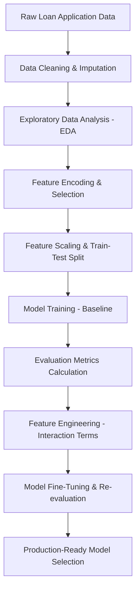

# 💼 CreditWise: Predicting Loan Approvals with Machine Learning

[](https://www.python.org/)
[](https://scikit-learn.org/)
[](https://pandas.pydata.org/)
[](https://opensource.org/licenses/MIT)

An end-to-end machine learning project built to help lending institutions automate credit underwriting, evaluate borrower risk, and predict loan approvals. Using a dataset of 1,000 credit profiles, I developed and tuned models to achieve **87.5% accuracy** and **79.0% precision**—helping speed up approval turnaround times while keeping default risks to a minimum.

---

## 🔍 The Pipeline & Modeling Workflow

The project follows a standard machine learning workflow, from clean-up to evaluation. Here is the general structure:



### How the Pipeline Works

1. **Data Cleaning & Imputation**:
   - Dropped the `Applicant_ID` column to prevent data leakage and overfitting.
   - Handled missing values using `SimpleImputer`—using the mean for numerical columns and the most frequent values for categorical ones.
2. **Exploratory Data Analysis (EDA)**:
   - Handled a **70.2% to 29.8% target class imbalance** on `Loan_Approved`.
   - Identified key patterns in the data, such as a strong loan approval threshold for applicants with a Credit Score above `650`.
3. **Feature Encoding**:
   - Applied Label Encoding to ordinal features (like `Education_Level`) and the target variable (`Loan_Approved`).
   - One-hot encoded nominal attributes (like `Employment_Status`, `Marital_Status`, `Loan_Purpose`, etc.), dropping the first category to avoid the dummy variable trap.
4. **Feature Scaling**:
   - Scaled continuous variables using `StandardScaler` to ensure distance-based models (like KNN) and coefficient magnitudes (like Logistic Regression) are balanced.

---

## 📊 Model Evaluation & Results

To find the best approach, I trained and compared **Logistic Regression**, **Naive Bayes**, and **K-Nearest Neighbors (KNN)**. Each model was evaluated in two configurations:
* **Baseline**: Trained on standard, cleaned features.
* **Fine-Tuned / Engineered**: Trained after adding engineered polynomial features (specifically `DTI_Ratio_sq` ($DTI^2$) and `Credit_Score_sq` ($Score^2$)), while dropping the original linear variables to prevent collinearity issues.

| Model & Stage | Accuracy | Precision | Recall | F1-Score | Confusion Matrix (TN, FP, FN, TP) |
| :--- | :---: | :---: | :---: | :---: | :---: |
| **Logistic Regression (Baseline)** | 86.5% | 78.3% | 77.0% | 77.7% | `[[126, 13], [14, 47]]` |
| **Logistic Regression (Fine-Tuned)** | **87.5%** | **79.0%** | **80.3%** | **79.7%** | `[[126, 13], [12, 49]]` |
| **Naive Bayes (Baseline)** | 86.5% | 80.4% | 73.8% | 76.9% | `[[128, 11], [16, 45]]` |
| **Naive Bayes (Fine-Tuned)** | 86.5% | 78.3% | 77.0% | 77.7% | `[[126, 13], [14, 47]]` |
| **KNN Classifier (Baseline)** | 76.0% | 62.7% | 52.5% | 57.1% | `[[120, 19], [29, 32]]` |
| **KNN Classifier (Fine-Tuned)** | 75.5% | 62.0% | 50.8% | 55.9% | `[[120, 19], [30, 31]]` |

### 💡 Key Takeaways
* **Logistic Regression with engineered features** won across the board, pushing accuracy to **87.5%** and recall to **80.3%**. Adding quadratic features helped the model capture non-linear relationships without needing a complex tree ensemble.
* **Naive Bayes** is a remarkably solid baseline. It hit **80.4% precision** out-of-the-box, showing that the credit datasets have well-behaved probability distributions.
* **KNN struggled with the curse of dimensionality**. After one-hot encoding, we had 28 dimensions, making distance calculations sparse and pulling accuracy down to **76.0%**.

---

## 🚀 Roadmap for Further Improvements

If I were to take this system into a production environment, here are the top 5 areas I would focus on to push performance even further:

### 1. Handling Class Imbalance (SMOTE & Class Weights)
Right now, the dataset is skewed—about 70% of applications are rejected and only 30% approved. This can make the model overly conservative. 
* **What to do**: I would try using `SMOTE` (from the `imbalanced-learn` library) on the training set to generate synthetic minority samples, or simply use `class_weight='balanced'` in the Logistic Regression setup. This will help the model learn the characteristics of approved loans much better.

### 2. Trying Ensemble Models (XGBoost, Random Forests)
While Logistic Regression is highly interpretable, linear models struggle to find complex decision boundaries.
* **What to do**: I'd implement tree-based ensemble methods like **XGBoost**, **LightGBM**, or **Random Forests**. These handle mixed data types easily and automatically capture non-linear split points (e.g., Credit Score $> 650$ combined with a high income bracket) without requiring manual interaction term engineering.

### 3. Systematic Hyperparameter Optimization
Our current models are running on mostly default or basic parameters, meaning we are likely leaving some performance on the table.
* **What to do**: I'd set up a robust tuning loop using `GridSearchCV` or `RandomizedSearchCV` paired with Stratified 5-Fold Cross-Validation. Specifically, I'd tune the regularization strength ($C$) in Logistic Regression or the tree depth and learning rate in XGBoost.

### 4. Creating Domain-Specific Financial Ratios
Right now, the models look at individual numeric columns, but in real underwriting, the relationships between these columns matter most.
* **What to do**: I'd engineer domain-specific features like:
  - **Total Household Income**: Combining applicant and coapplicant incomes.
  - **Collateral-to-Loan Ratio**: To measure the security of the loan.
  - **Debt Service Coverage**: A feature linking monthly income, existing debt, and the new loan amount.

### 5. Transitioning to K-Fold Cross-Validation
Evaluating on a single train-test split can introduce split-bias and variance.
* **What to do**: Implementing `StratifiedKFold` (with 5 or 10 folds) would ensure every evaluation split has the same target distribution as the overall dataset. This will give us much more stable, honest, and generalized validation scores before any deployment.

---

## 🛠️ How to Run the Project Locally

If you want to pull this down and run the notebook on your local machine, here is the quick-start guide:

### 1. Clone and Navigate
```bash
git clone <repository-url>
cd CreditWise_Loan_System-A_Loan_Approval_Prediction_System
```

### 2. Spin Up a Virtual Environment
* **On Windows (PowerShell):**
  ```powershell
  python -m venv .venv
  .venv\Scripts\Activate.ps1
  ```
* **On macOS/Linux:**
  ```bash
  python3 -m venv .venv
  source .venv/bin/activate
  ```

### 3. Install the Packages
```bash
pip install -r requirements.txt
```
*(Note: If you run into any issues, the core dependencies are `pandas`, `numpy`, `scikit-learn`, `seaborn`, `matplotlib`, and `ipykernel`.)*

### 4. Open and Run the Notebook
Open `CreditWiseLoanSystem.ipynb` in your favorite IDE (like VS Code or Jupyter Lab), select the `.venv` environment as your kernel, and run all cells to see the data prep and model results in action.