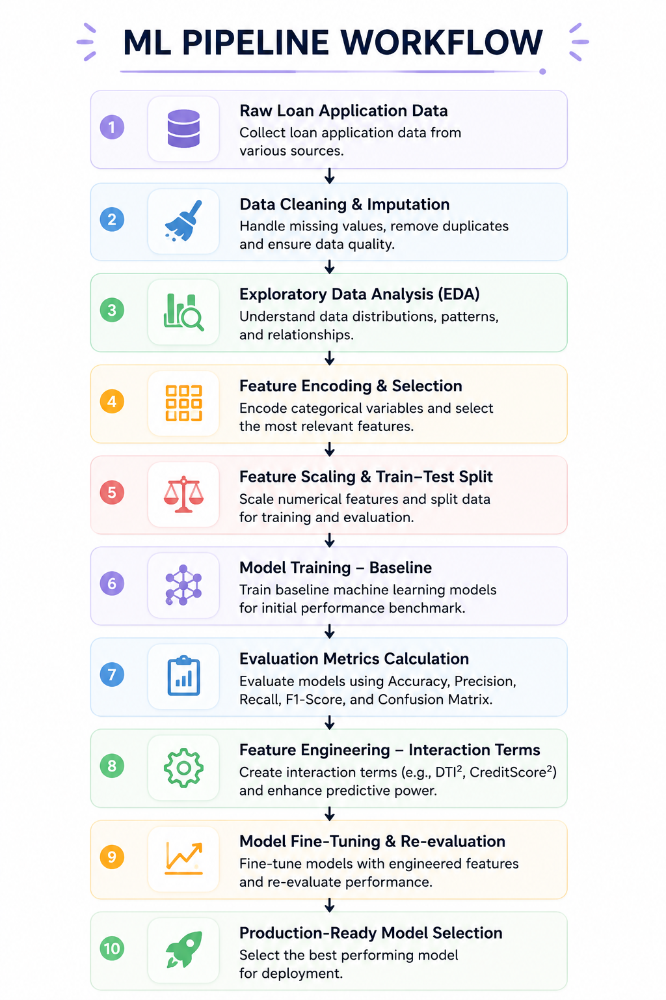
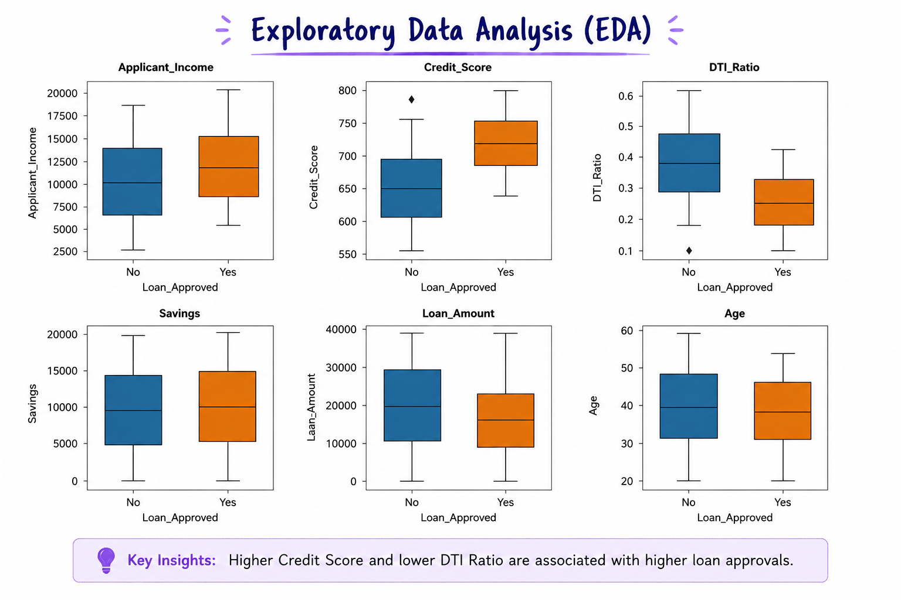
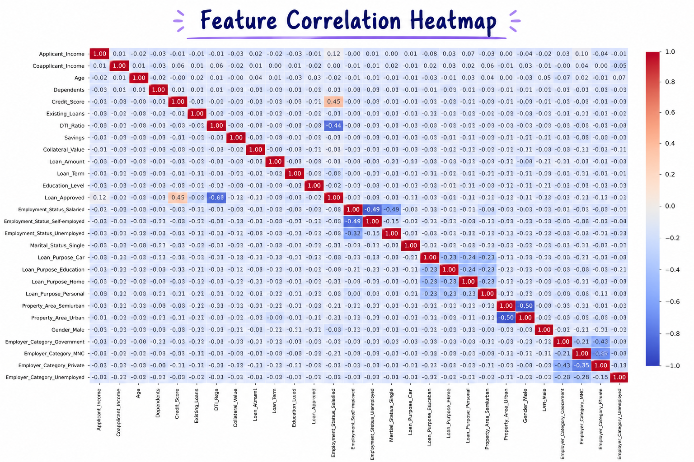
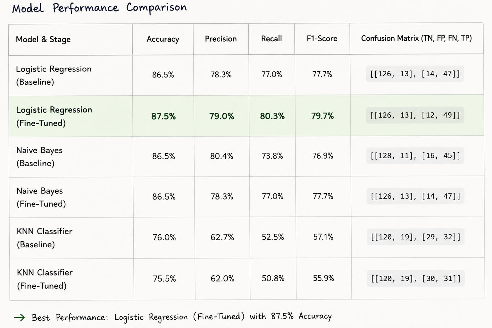

# 💼 CreditWise: Predicting Loan Approvals with Machine Learning

[](https://www.python.org/)
[](https://scikit-learn.org/)
[](https://pandas.pydata.org/)
[](https://opensource.org/licenses/MIT)

An end-to-end machine learning project built to help lending institutions automate credit underwriting, evaluate borrower risk, and predict loan approvals. Using a dataset of 1,000 credit profiles, I developed and tuned models to achieve **87.5% accuracy** and **79.0% precision**—helping speed up approval turnaround times while keeping default risks to a minimum.

---

## 🔍 The Pipeline & Modeling Workflow

The project follows a standard machine learning workflow, from clean-up to evaluation. Here is the general structure:



### Behind the Scenes: How the Pipeline is Built

To get the raw application data ready for modeling, I built a structured preprocessing pipeline:

* **Cleaning up the noise**: I dropped the `Applicant_ID` column right away since it's just a database key and would cause the model to overfit. Any missing values in the numeric features were imputed with the mean, while missing categorical values were filled with the most frequent category.
* **Exploring the patterns (EDA)**: I noticed a pretty significant class imbalance—about **70% of the applicants were approved, while 30% were rejected**. The data also showed a clear signal: applicants with a credit score above `650` were far more likely to get approved.

  
  
* **Encoding variables**: I converted ordinal categories (like `Education_Level`) using simple label encoding, and nominal categories (like `Employment_Status` or `Marital_Status`) using one-hot encoding. I also made sure to drop the first category in the one-hot encoding to avoid the dummy variable trap (multicollinearity).
* **Feature Scaling**: Since distance-based models like KNN and linear coefficients in Logistic Regression are sensitive to scale, I passed all continuous features through `StandardScaler` to keep everything on an even playing field.

---

## 📊 Model Evaluation & Results

To find the best approach, I trained and compared **Logistic Regression**, **Naive Bayes**, and **K-Nearest Neighbors (KNN)**. Each model was evaluated in two configurations:
* **Baseline**: Trained on standard, cleaned features.
* **Fine-Tuned / Engineered**: Trained after adding engineered polynomial features (specifically `DTI_Ratio_sq` ($DTI^2$) and `Credit_Score_sq` ($Score^2$)), while dropping the original linear variables to prevent collinearity issues.

| Model & Stage | Accuracy | Precision | Recall | F1-Score | Confusion Matrix (TN, FP, FN, TP) |
| :--- | :---: | :---: | :---: | :---: | :---: |
| **Logistic Regression (Baseline)** | 86.5% | 78.3% | 77.0% | 77.7% | `[[126, 13], [14, 47]]` |
| **Logistic Regression (Fine-Tuned)** | **87.5%** | **79.0%** | **80.3%** | **79.7%** | `[[126, 13], [12, 49]]` |
| **Naive Bayes (Baseline)** | 86.5% | 80.4% | 73.8% | 76.9% | `[[128, 11], [16, 45]]` |
| **Naive Bayes (Fine-Tuned)** | 86.5% | 78.3% | 77.0% | 77.7% | `[[126, 13], [14, 47]]` |
| **KNN Classifier (Baseline)** | 76.0% | 62.7% | 52.5% | 57.1% | `[[120, 19], [29, 32]]` |
| **KNN Classifier (Fine-Tuned)** | 75.5% | 62.0% | 50.8% | 55.9% | `[[120, 19], [30, 31]]` |



### 💡 What the numbers tell us
* **Tuning paid off for Logistic Regression**: By adding quadratic features for the DTI Ratio and Credit Score ($DTI^2$ and $Score^2$), the model got better at capturing non-linear behavior. This push raised the accuracy to **87.5%** and recall to **80.3%**, which is exactly what a lending institution wants (catching more qualified borrowers while keeping defaults low).
* **Naive Bayes holds its own**: The baseline Naive Bayes model actually had the highest initial precision (**80.4%**), which means it's very reliable when it predicts a loan will be approved.
* **KNN was held back by the dimensionality**: After one-hot encoding our categories, the feature space expanded to 28 columns. Because KNN relies on Euclidean distance, this high-dimensional space made the data points feel far apart (the 'curse of dimensionality'), dropping its accuracy to **76.0%**.

---

## 🚀 Next Steps: How I'd Take This Further

If I had more time or were preparing this for a production launch, here are the 5 things I'd tackle next to boost performance:

1. **Balance the Dataset**: Right now, the data is heavily skewed towards loan rejections (70/30 split), which makes the model naturally conservative. I'd use `SMOTE` (Synthetic Minority Over-sampling) on the training set to generate synthetic examples of approved loans, or adjust `class_weight='balanced'` in scikit-learn.
2. **Move Beyond Linear Models**: Logistic Regression is fantastic for understanding feature importance, but tree ensembles like **XGBoost** or **Random Forest** are much better at automatically finding thresholds (like a combination of a Credit Score $> 650$ and a certain income range) without having to manually engineer polynomial variables.
3. **Squeeze Out More Performance with Hyperparameter Tuning**: Most of the models are running close to default settings. I'd set up a systematic search using `GridSearchCV` or `RandomizedSearchCV` with 5-fold cross-validation to find the optimal values for regularization strength or tree depth.
4. **Engineer Better Financial Indicators**: In the real world, lenders look at ratios, not just flat values. I'd combine the existing features into domain-specific metrics, such as:
   - **Combined Income**: Adding applicant and coapplicant incomes.
   - **LTV (Loan-to-Value) Ratio**: Comparing the loan amount requested to the collateral value.
   - **Debt-to-Income (DTI) Tweaks**: Making sure the DTI ratio properly accounts for all existing debt payments relative to total income.
5. **Implement Stratified K-Fold Cross-Validation**: To make sure the metrics aren't just a result of a lucky train-test split, I'd move to a 5- or 10-fold cross-validation setup. This ensures every slice of the data we test on has the same 70/30 class ratio as the original dataset.

---

## 🛠️ How to Run the Project Locally

If you want to pull this down and run the notebook on your local machine, here is the quick-start guide:

### 1. Clone and Navigate
```bash
git clone <repository-url>
cd CreditWise_Loan_System-A_Loan_Approval_Prediction_System
```

### 2. Spin Up a Virtual Environment
* **On Windows (PowerShell):**
  ```powershell
  python -m venv .venv
  .venv\Scripts\Activate.ps1
  ```
* **On macOS/Linux:**
  ```bash
  python3 -m venv .venv
  source .venv/bin/activate
  ```

### 3. Install the Packages
```bash
pip install -r requirements.txt
```
*(Note: If you run into any issues, the core dependencies are `pandas`, `numpy`, `scikit-learn`, `seaborn`, `matplotlib`, and `ipykernel`.)*

### 4. Open and Run the Notebook
Open `CreditWiseLoanSystem.ipynb` in your favorite IDE (like VS Code or Jupyter Lab), select the `.venv` environment as your kernel, and run all cells to see the data prep and model results in action.